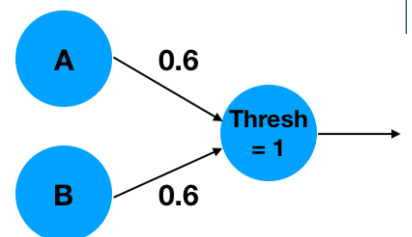
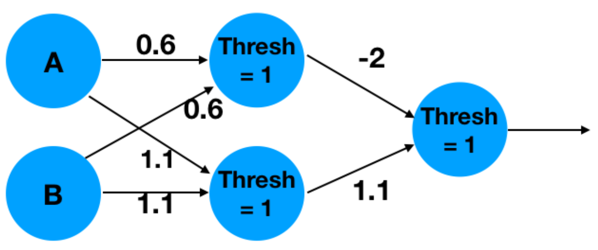
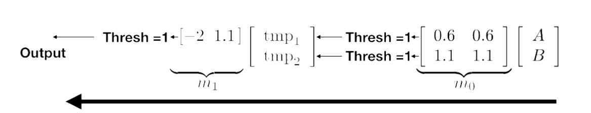

# PJ2

# 什么是神经网络

# proj2

这个project通过使用汇编语言，实现一个简单的神经网络

下面是笔者对[project官方描述文档](https://inst.eecs.berkeley.edu/~cs61c/su20/projects/proj2/)的阅读笔记

神经网络是**试图近似将您的输入映射到所需输出的（非线性）函数**，比如在网页给出的例子中：

​​

通过0.6这一参数，输出为（当结果大于1，则结果为1）：

$$
\begin{bmatrix}0.6
 \\0.6

\end{bmatrix}\times \begin{bmatrix}A
 \\B

\end{bmatrix}
$$

这样，就完成了神经网络为底层的`AND`​运算

接下来我们看一个神经网络实现更复杂函数的例子，比如这个`XOR`​:

​​

它有两个layer，通过两个中间值，计算出最终的结果，其计算过程如下图：

​​

网络上的权重的确定涉及到更复杂的议题，不在这里展开，但是要指出习得权重被称为**训练**，使用权重被称为**推理**。在本project种，我们只使用推理

# 手写笔迹识别

本项目中，我们会实现一个原理相同，但是更复杂的网络：

* 我们使用 [MNIST ](http://yann.lecun.com/exdb/mnist/)数据集，其包含 60,000 张 28x28 图像，其中包含 0-9 范围内的手写数字
* 我们使用预训练的权重，同时将使用两种不同的非线性来代替阈值： `ReLU`​和 `ArgMax`​功能

# PartA：数学函数

是四个部分：

* Relu
* argmax
* dot product
* Matrix Multiplication
